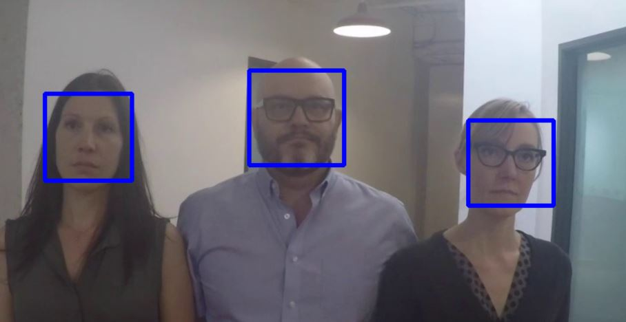

# Face-Detection-Image-Video
OpenCV Python: a Face Detection using Haar Cascade Classifiers 

## Sample of Detecting faces in a Picture
.

>**Reference Picture:**
>[Aidan Turner](https://www.imdb.com/name/nm2636108/)

## Sample of Detecting faces in a Video
.

>**Reference video:**
>[sample-videos](https://github.com/intel-iot-devkit/sample-videos.git)
